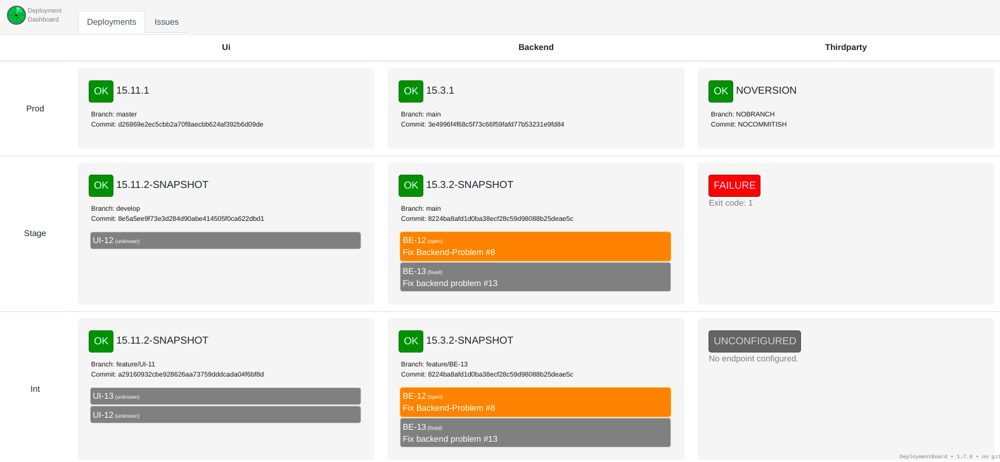

# POBoard

[](https://github.com/cbuschka/poboard) [](https://github.com/cbuschka/poboard/blob/main/license.txt)

### Deployment dashboard to display which story is deployed where



## Prerequisites

- docker/ docker-compose
- java 11
- maven

## Features

- configurable environments (default: dev, int, stage, prod)
- supported auth types: rsa key, plain text password
- supported deployment info retrieval methods: http, https, scp/sftp, ssh
- supported deployment info formats: properties, json, yaml
- supported code repos: git via ssh

## Usage

```bash
docker run --name poboard --rm \
  -e JAVA_TOOL_OPTIONS='-Dpoboard.config=file:/config/config.yaml -Dpoboard.masterpassword=' \
  -v ${PWD}/backend/src/test/resources/test-config.yaml:/config/config.yaml \
  -v ${PWD}/workspace/:/tmp/workspace:rw \
  -p 8080:8080 \
  cbuschka/poboard:latest
```

## Local Development

### Start Test Environment

```bash
make start-services
```

### Develop Frontend

```bash
cd frontend/src/main/frontend && \
  nvm use && \
  yarn install && \
  yarn run start
```

### Run and Debug

Then run and debug the spring boot webapp via your preferred IDE.

### Build Docker Image

```bash
make build
```

### Test Docker Image

```bash
make start-poboard
```

### Show Status of Test Environment

```bash
make show-status
```

### Tail Test Environment Logs

```bash
make tail-logs
```

### Shutdown Test Environment

```bash
make stop-services
```

## License

Copyright (c) 2021 by [Cornelius Buschka](https://github.com/cbuschka).

[Apache License, Version 2.0](./license.txt)
